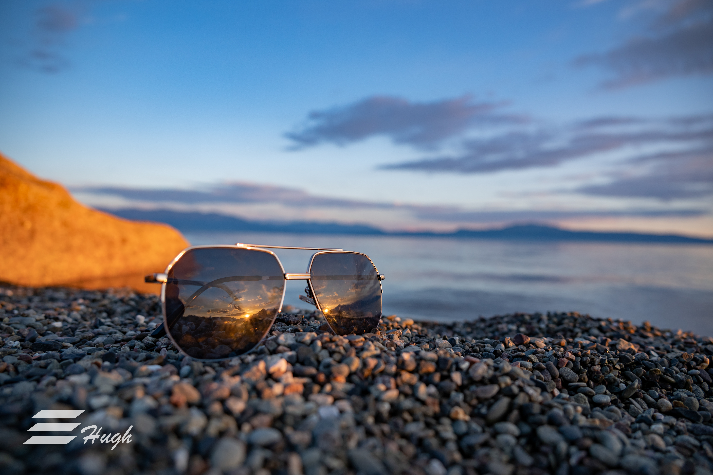
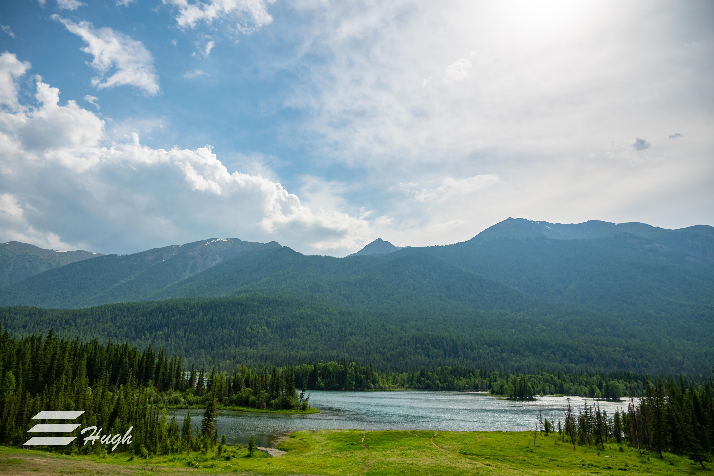
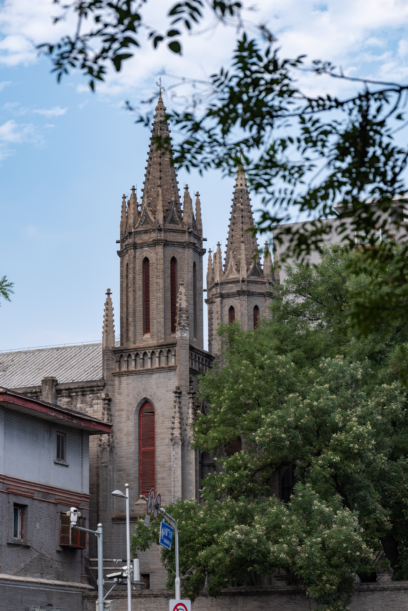
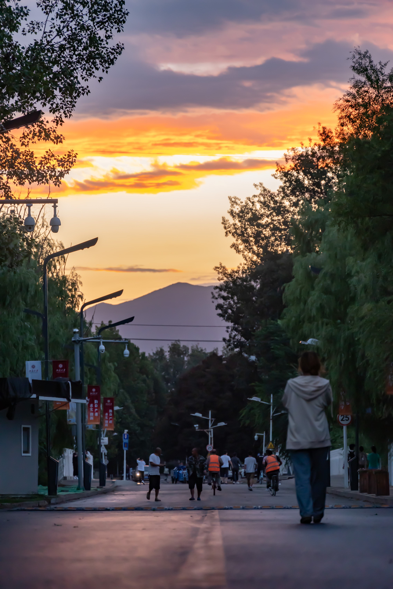
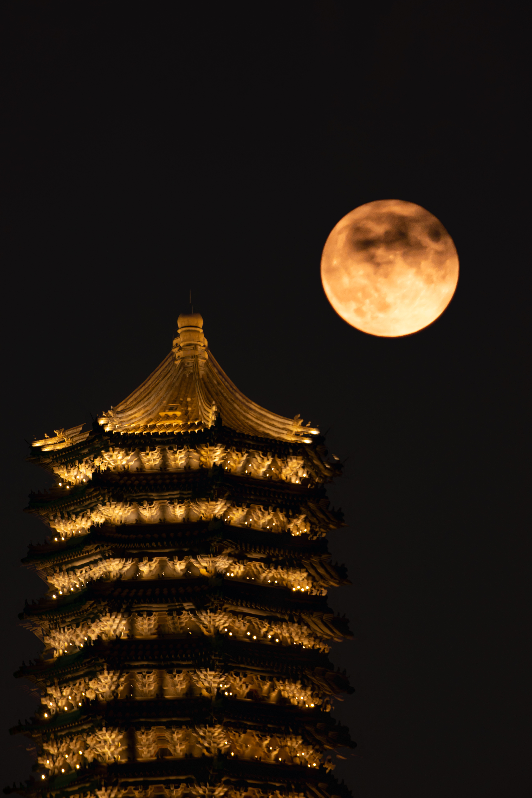
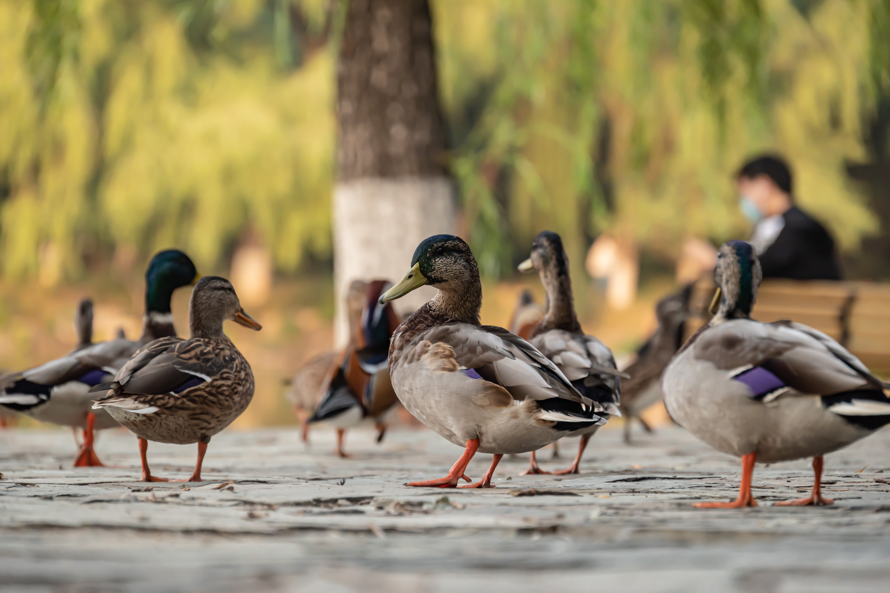
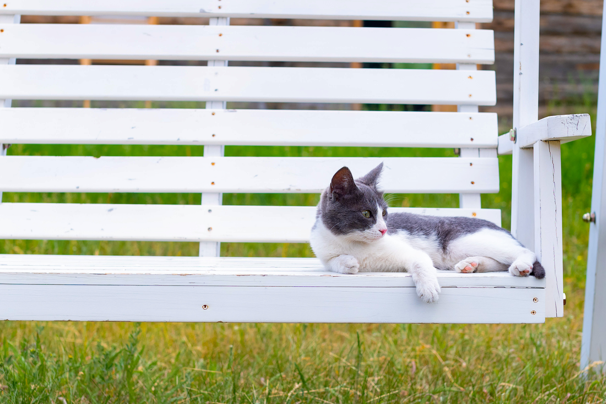
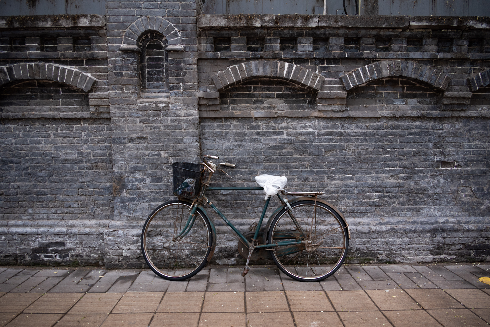
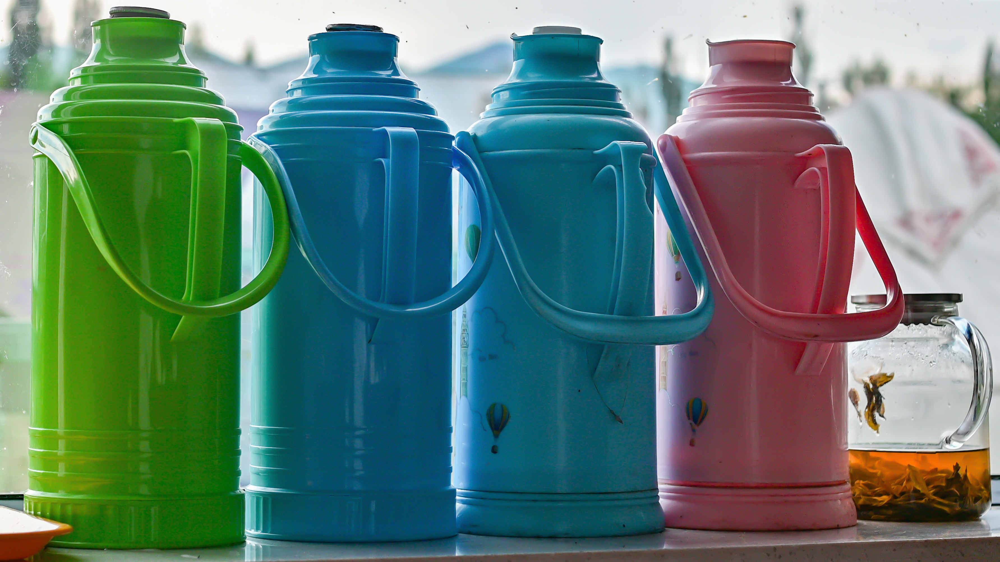

 
<html>
<head>
	<title>Shiqian Li's Photography</title>
	
	
	
</head>
 
<body>
	

		
Nature

		
Animal

		
Portrait

		
Life

	

	
	

	
        

        

        

	

	

	

	

	

	

	

	

	

	

	

	

	

	

	

	

        

 
</body>
</html>

<!-- # Shiqian Li's Photography

## Sayram Lake, Xinjiang, China

## Kanas, Xinjiang, China

## Colorful Beach, Xinjiang, China

## Hemu, Xinjiang, China

<video width=960 height=540 controls>
  <source style="margin:0 auto;" src="photos/hemu2.mp4" type="video/mp4">
</video>

## A full version of time-lapse photography in Xinjiang

https://www.bilibili.com/video/BV1kY4y177T6?spm_id_from=333.999.0.0
 -->
